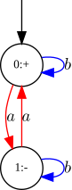
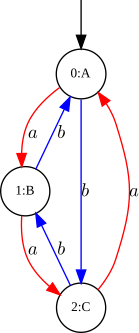
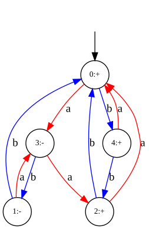
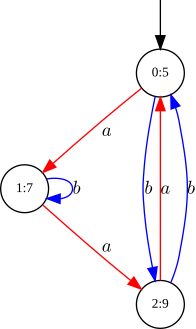
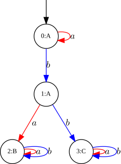
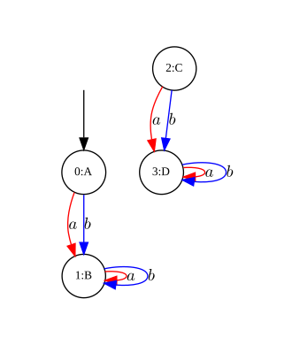
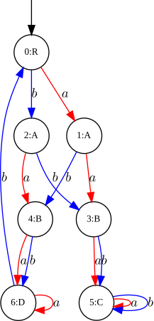

# Examples of Automata
<figure style="text-align: center;">
  
  <figcaption><em>two_state_flip()</em></figcaption>
</figure>

<figure style="text-align: center;">
  
  <figcaption><em>three_state_cycle()</em></figcaption>
</figure>

<figure style="text-align: center;">
  
  <figcaption><em>basic test automaton</em></figcaption>
</figure>

<figure style="text-align: center;">
  
  <figcaption><em>parser_numeric_example()</em></figcaption>
</figure>

<figure style="text-align: center;">
  
  <figcaption><em>parser_symbolic_example()</em></figcaption>
</figure>

<figure style="text-align: center;">
  
  <figcaption><em>Automaton unreachable_example()</em></figcaption>
</figure>

<figure style="text-align: center;">
  
  <figcaption><em>degree_two_example()</em></figcaption>
</figure>